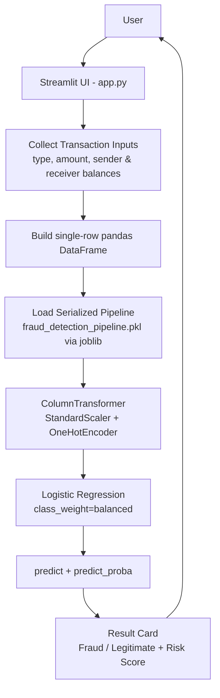
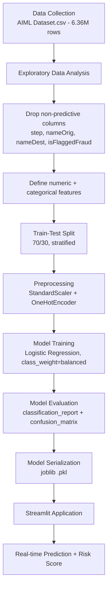
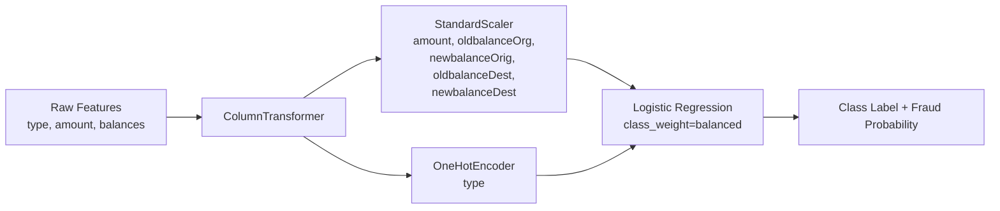

# 🔐 AI Fraud Detection System

**A Machine Learning system that classifies financial transactions as fraudulent or legitimate in real time, served through an interactive Streamlit application.**

<p align="left">
  
  
  
  
  
</p>

Financial fraud is rare, expensive, and hard to catch with rule-based systems. This project builds a supervised classification pipeline on **6.36M+ historical mobile-money transactions**, trains a **Logistic Regression classifier with class-imbalance handling**, and deploys it behind a Streamlit interface so a user can enter transaction details and instantly get a fraud prediction with a probability-based risk score. It is aimed at recruiters and engineers who want to see an end-to-end ML workflow — from raw data to a running application — rather than an isolated notebook.

---

## 1. 🚀 Project Overview

**Problem.** Fraudulent transactions in payment systems are extremely rare relative to legitimate ones (in this dataset, only **0.13%** of transactions are fraudulent), which makes naive classifiers ineffective — a model that always predicts "legitimate" would already be 99.87% "accurate" while catching zero fraud.

**Proposed solution.** A Scikit-learn preprocessing + classification pipeline trained with class-weight balancing, wrapped in a Streamlit app that turns raw transaction fields into a fraud/legitimate prediction plus a fraud probability score.

**Target users.** Recruiters and engineers evaluating ML/data science skills, and as a reference implementation for anyone exploring imbalanced classification on transactional data.

**Real-world use case.** Payment platforms, digital wallets, and banks that need a first-pass, explainable screening layer to flag transactions for further review.

**Key value.** Demonstrates the full pipeline — EDA on millions of rows, feature preprocessing, imbalance-aware model training, evaluation beyond raw accuracy, model serialization, and deployment — in one coherent, working project.

---

## 2. 🎯 Objectives

- Analyze large-scale transaction data to understand fraud patterns.
- Train a classifier that can distinguish fraudulent from legitimate transactions.
- Handle severe class imbalance (fraud is 0.13% of all transactions) during training.
- Return a **fraud probability**, not just a hard label, so downstream systems can apply their own risk thresholds.
- Serve the trained model through a simple, real-time web interface.

---

## 3. ✨ Key Features

### Core Features
- End-to-end pipeline from raw CSV data to a deployable model artifact.
- Reusable Scikit-learn `Pipeline` — the exact preprocessing used at training time is reused at inference time (no train/serve skew).

### ML/AI Features
- Binary classification with **Logistic Regression** (`class_weight="balanced"`).
- Preprocessing via `ColumnTransformer`: `StandardScaler` on numeric fields, `OneHotEncoder` on the categorical `type` field.
- Fraud probability output via `predict_proba()`, not just a class label.
- Model persisted with `joblib` and loaded by the app at runtime.

### User Interface Features
- Interactive Streamlit form for entering transaction type, amount, and sender/receiver balances.
- Color-coded result card (🚨 Fraudulent / ✅ Legitimate) with the fraud probability shown as a percentage.
- Visual fraud-probability progress bar with Low / Medium / High risk labels.
- Basic input validation (transaction amount must be greater than 0) with inline warnings.

### Engineering Features
- Cached model loading (`st.cache_resource`) so the pipeline isn't reloaded on every interaction.
- Defensive error handling if the model file is missing or fails to load (including a scikit-learn version hint, since the model was serialized with `scikit-learn==1.6.1`).
- `.devcontainer` configuration for one-click, reproducible setup in GitHub Codespaces / VS Code.

---

## 4. 🏗️ System Architecture



**Component summary**
- **Streamlit UI (`app.py`)** — collects the six transaction fields the model needs and triggers prediction on button click.
- **Serialized pipeline (`models/fraud_detection_pipeline.pkl`)** — a single Scikit-learn object containing both preprocessing and the classifier, so the app never has to duplicate feature-engineering logic.
- **ColumnTransformer** — scales the five numeric fields and one-hot encodes the transaction `type`.
- **Logistic Regression classifier** — produces the fraud/legitimate label and the underlying probability used for the risk score.

---

## 5. 🔄 Project Workflow



This is the exact sequence implemented in `notebook/analysis_model.ipynb`.

---

## 6. 🧠 Machine Learning Pipeline

1. **Dataset** — `data/AIML Dataset.csv`, 6,362,620 rows × 11 columns.
2. **Features used by the model** — `type`, `amount`, `oldbalanceOrg`, `newbalanceOrig`, `oldbalanceDest`, `newbalanceDest`.
3. **Target variable** — `isFraud` (binary).
4. **Dropped columns** — `step` (time index), `nameOrig`, `nameDest` (identifiers), `isFlaggedFraud` (a pre-existing rule-based flag, excluded to avoid leakage/redundancy).
5. **Exploratory feature engineering** — `balanceDiffOrig` (`oldbalanceOrg − newbalanceOrig`) and `balanceDiffDest` (`newbalanceDest − oldbalanceDest`) were derived and examined during EDA, but were **not** included in the final model's feature set (the deployed pipeline only consumes the six columns listed above).
6. **Encoding** — `OneHotEncoder(drop="first")` on `type`.
7. **Scaling** — `StandardScaler` on the five numeric columns.
8. **Train/Test split** — 70/30, stratified on `isFraud` (`train_test_split(..., test_size=0.3, stratify=y)`).
9. **Model** — `LogisticRegression(class_weight="balanced", max_iter=1000)`.
10. **Evaluation metrics** — `classification_report` (precision, recall, F1) and `confusion_matrix` on the held-out test set.
11. **Model selection** — only one model (Logistic Regression) was trained and evaluated in this project; no comparison against alternative algorithms is present in the notebook.
12. **Serialization** — the full pipeline (preprocessing + classifier) saved with `joblib.dump(pipeline, "fraud_detection_pipeline.pkl")`.



---

## 7. 🤖 Models Used

| Model | Purpose | Evaluation Metric | Result (test set) |
|---|---|---|---|
| Logistic Regression (`class_weight="balanced"`, `max_iter=1000`) | Binary fraud classification | Accuracy / Precision / Recall / F1 | Accuracy **94.6%** · Fraud recall **0.95** · Fraud precision **0.02** · Fraud F1 **0.04** |

Only one model was trained in this project, so it is the final model by default — there is no comparison table to select from. The metrics above come directly from `classification_report` / `confusion_matrix` on the 30% stratified test split (see [Results](#10--results)).

---

## 8. 📊 Exploratory Data Analysis

Performed in `notebook/analysis_model.ipynb`:

- **Dataset shape:** 6,362,620 rows × 11 columns, with **no missing values** in any column.
- **Class balance:** `isFraud` = 1 for 8,213 transactions vs. 6,354,407 legitimate — a **0.13% fraud rate**.
- **`isFlaggedFraud` flag:** only 16 transactions out of 6.36M are flagged by the dataset's existing rule-based system, confirming it is not a reliable stand-alone fraud detector.
- **Transaction types:** distribution of `type` (`PAYMENT`, `TRANSFER`, `CASH_OUT`, `DEBIT`, `CASH_IN`) plotted as a bar chart, alongside **fraud rate by transaction type** — fraud in this dataset occurs only within `TRANSFER` and `CASH_OUT` types.
- **Amount distribution:** visualized on a log scale (`log1p(amount)`) due to heavy right-skew; amount vs. `isFraud` also compared with a boxplot (filtered to transactions under 50,000).
- **Balance-difference analysis:** `balanceDiffOrig` and `balanceDiffDest` computed to check for inconsistent balance updates; counts of negative differences inspected.
- **Temporal pattern:** frauds-per-`step` plotted to see how fraud count varies over the recorded time steps.
- **Correlation analysis:** correlation heatmap across `amount`, `oldbalanceOrg`, `newbalanceOrig`, `oldbalanceDest`, `newbalanceDest`, and `isFraud`.
- **Zero-balance-after-transfer pattern:** transactions where the sender's balance drops to exactly zero after a `TRANSFER`/`CASH_OUT` were isolated as a suspicious pattern for closer inspection.

*No EDA chart images were included in the uploaded project assets, so plots are not embedded here — they can be reproduced by running the notebook.*

---

## 9. 🖥️ Application / UI

Screenshots below are taken directly from the running Streamlit app (`Project Explanation Images/` in this repository).

### Transaction Input Interface

Two-column form for entering transaction type, amount, and sender/receiver balances before running a prediction.

### Legitimate Transaction Result

A transaction classified as legitimate, shown with a green result card, fraud probability, and a "Low fraud risk" indicator.

### Fraudulent Transaction Result

A transaction classified as fraudulent, shown with a red result card, computed fraud probability, and a corresponding risk level.

### Input Validation

The app surfaces a warning banner when submitted balance values look inconsistent, prompting the user to double-check the entered figures.

> The repository's `Project Explanation Images/` folder also contains additional concept/illustration graphics (e.g. a multi-panel analytics dashboard mockup). Those are design illustrations of a possible future product surface — they are **not** part of the current Streamlit application and are intentionally not presented here as app screenshots.

---

## 10. 📈 Results

Evaluated on the 30% stratified hold-out test set (1,908,786 transactions):

| Class | Precision | Recall | F1-score | Support |
|---|---:|---:|---:|---:|
| Legitimate (0) | 1.00 | 0.95 | 0.97 | 1,906,322 |
| Fraud (1) | 0.02 | 0.95 | 0.04 | 2,464 |
| **Overall accuracy** | | | **0.9462** | 1,908,786 |

**Confusion matrix**

|  | Predicted Legitimate | Predicted Fraud |
|---|---:|---:|
| **Actual Legitimate** | 1,803,734 | 102,588 |
| **Actual Fraud** | 128 | 2,336 |

**Interpretation.** With class-weight balancing, the model catches **95% of actual fraud cases** (2,336 of 2,464), which is the priority in a fraud-screening context. The trade-off is very low precision (2%) — the model also flags a large number of legitimate transactions (102,588) as potentially fraudulent. In production this model would need threshold tuning and cost-sensitive evaluation rather than being used as-is, since flagging ~5% of *all* legitimate transactions for review has a real operational cost. This is documented as a known limitation, not hidden.

---

## 11. 🛠️ Tech Stack

| Category | Technology |
|---|---|
| Language | Python |
| Data Processing | Pandas, NumPy |
| Visualization | Matplotlib, Seaborn |
| Machine Learning | Scikit-learn 1.6.1 (`LogisticRegression`, `ColumnTransformer`, `StandardScaler`, `OneHotEncoder`, `Pipeline`) |
| Model Serialization | Joblib |
| Application / Frontend | Streamlit |
| Dev Environment | `.devcontainer` (VS Code / GitHub Codespaces, Python 3.11) |
| Version Control | Git / GitHub |

---

## 12. 📁 Project Structure

```
Fraud Detection/
│
├── .devcontainer/
│   └── devcontainer.json          # Codespaces / VS Code dev container config
│
├── data/
│   └── AIML Dataset.csv           # Raw transaction dataset (6.36M rows)
│
├── models/
│   └── fraud_detection_pipeline.pkl   # Serialized Scikit-learn pipeline (preprocessing + classifier)
│
├── notebook/
│   └── analysis_model.ipynb       # EDA, feature engineering, training, evaluation
│
├── Project Explanation Images/
│   ├── Transaction Input Interface.jpeg
│   ├── Legitimate Transaction Result.jpeg
│   ├── Fraudulent Transaction Result.jpeg
│   ├── Validation Warning.jpeg
│   └── (additional concept/illustration graphics)
│
├── app.py                         # Streamlit application entry point
├── requirements.txt                # Python dependencies
├── .gitignore
└── README.md
```

**Key files**
- `app.py` — loads the serialized pipeline and renders the prediction UI.
- `notebook/analysis_model.ipynb` — the full training and evaluation process, from raw CSV to `fraud_detection_pipeline.pkl`.
- `models/fraud_detection_pipeline.pkl` — the artifact `app.py` loads at runtime; no retraining is needed to run the app.

---

## 13. ⚙️ Installation & Setup

### Clone the repository

```bash
git clone https://github.com/harshantla-cloud/Fraud-Detection-System.git
cd "Fraud Detection"
```

### Create and activate a virtual environment

**Windows**
```bash
python -m venv venv
venv\Scripts\activate
```

**macOS / Linux**
```bash
python3 -m venv venv
source venv/bin/activate
```

### Install dependencies

```bash
pip install -r requirements.txt
```

> The serialized model was created with **scikit-learn 1.6.1**. If prediction fails after loading, confirm your installed scikit-learn version matches the one pinned in `requirements.txt`.

### Run the application

```bash
streamlit run app.py
```

The app will open in your browser (default: `http://localhost:8501`). The trained model is already included at `models/fraud_detection_pipeline.pkl`, so the app runs immediately — you do not need to re-run the notebook or re-download the dataset to try it.

### (Optional) Reproduce training

To re-run the analysis and retrain the model from scratch:

```bash
jupyter notebook notebook/analysis_model.ipynb
```

The notebook reads `../data/AIML Dataset.csv` and writes the pipeline out with `joblib.dump(pipeline, "fraud_detection_pipeline.pkl")`.

---

## 14. 💼 Recruiter / Portfolio Highlights

This project demonstrates hands-on experience with:

- Working with a large (6M+ row) real-world-style transactional dataset.
- Exploratory data analysis for imbalanced classification problems.
- Building a leak-aware feature set (explicitly excluding identifier columns and a pre-existing fraud flag).
- Scikit-learn `Pipeline` / `ColumnTransformer` design for reproducible preprocessing.
- Handling severe class imbalance with `class_weight="balanced"`.
- Evaluating a classifier with precision, recall, and F1 — not just accuracy — and being explicit about the resulting precision/recall trade-off.
- Model persistence with Joblib and consuming that artifact from a separate application layer.
- Building and deploying an interactive Streamlit application on top of a trained model.

**Suggested resume line**
> Built an end-to-end fraud detection system on a 6.36M-row transaction dataset using a Scikit-learn preprocessing pipeline and class-weighted Logistic Regression, evaluated with precision/recall/F1 on a stratified hold-out set, and deployed as an interactive Streamlit application.

---

## 15. ⚠️ Limitations

- **Low fraud precision (2%).** The model over-flags legitimate transactions; it is tuned toward high recall via `class_weight="balanced"`, not toward a production-ready precision/recall balance.
- **Single model.** Only Logistic Regression was trained; no comparison against tree-based or gradient-boosted models (e.g. Random Forest, XGBoost) has been done yet.
- **No decision-threshold tuning.** The app uses the classifier's default 0.5 decision boundary; the risk-level bands (Low/Medium/High) are an application-level interpretation of `predict_proba()` output, not a separately calibrated threshold.
- **No feature importance / explainability layer** (e.g. SHAP) is currently implemented.
- **Dataset-specific.** The model is trained on this specific simulated transaction dataset and its patterns (e.g. fraud confined to `TRANSFER`/`CASH_OUT`); it is not validated against real banking data.

This project is intended as a portfolio / educational demonstration of an end-to-end ML workflow, not a production fraud-detection system.

---

## 16. 🔮 Possible Future Improvements

- [ ] Compare Logistic Regression against Random Forest / XGBoost / LightGBM.
- [ ] Hyperparameter tuning with cross-validation.
- [ ] Precision-Recall curve and ROC-AUC analysis, with a cost-sensitive decision threshold.
- [ ] SHAP-based model explainability.
- [ ] FastAPI backend as an alternative to the current Streamlit-only serving layer.
- [ ] Cloud deployment (e.g. Streamlit Community Cloud, Docker + a cloud provider).

---

## 👨‍💻 Author

**Harsh**
B.Tech CSE (2023–2027) · Data Science, Machine Learning & AI

- GitHub: [github.com/harshantla-cloud](https://github.com/harshantla-cloud)
- Project repository: [Fraud-Detection-System](https://github.com/harshantla-cloud/Fraud-Detection-System)

---

## 🔐 Disclaimer

This project is intended for **educational and portfolio demonstration purposes**. It should not be used as a production financial fraud detection system without further validation, threshold calibration, security review, and regulatory/compliance assessment.
