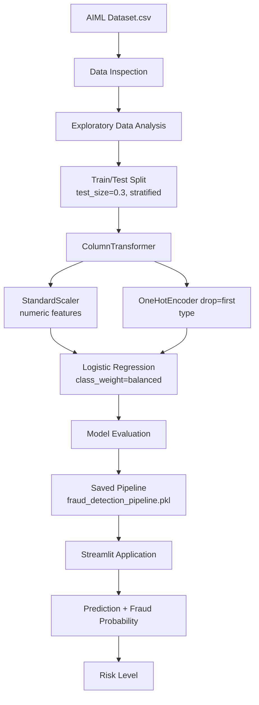
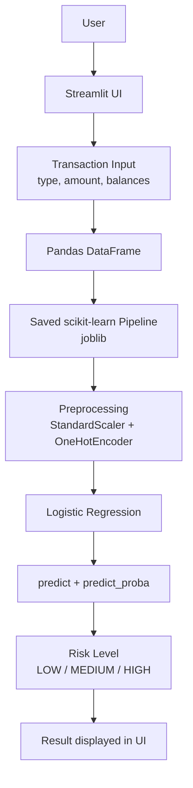

# 🔐 AI Fraud Detection System

An end-to-end machine learning project that classifies financial transactions as fraudulent or legitimate. A scikit-learn pipeline (preprocessing + Logistic Regression) is trained on a dataset of 6,362,620 transactions and served through a Streamlit application.

The app takes six transaction attributes, returns a fraud / legitimate classification, and reports the fraud probability with a LOW / MEDIUM / HIGH risk level. Fraud is rare in the dataset (0.13% of transactions), so the model is trained with class weighting to handle the imbalance.

[](https://github.com/harshantla-cloud/FRAUD-DETECTION-SYSTEM)


---

## 🚀 Project Overview

**Problem.** Fraudulent transactions are a tiny fraction of total volume, which makes them hard to catch with a model that is only optimised for overall accuracy.

**What "fraud detection" means here.** This is a supervised binary classification task. The target is `isFraud` (`1` = fraudulent, `0` = legitimate), predicted from the transaction type, the amount, and the balances of the origin and destination accounts before and after the transaction.

**How a transaction is analysed.**
1. The user enters the transaction details in the Streamlit app.
2. The inputs are passed to a saved scikit-learn pipeline loaded with `joblib`.
3. The pipeline scales the numeric features, one-hot encodes the transaction type, and applies Logistic Regression.
4. The app calls `predict()` for the class and `predict_proba()` for the fraud probability.

**What the app returns.**
- Classification: *Fraudulent Transaction* or *Legitimate Transaction*
- Fraud Risk Score
- Fraud Probability
- Risk level: LOW / MEDIUM / HIGH

---

## ✨ Features

- Streamlit interface for entering a single transaction
- Class prediction using `model.predict()`
- Fraud probability using `model.predict_proba()`
- Risk level derived from the probability (thresholds below)
- Preprocessing and model packaged as one scikit-learn `Pipeline`, saved to `models/fraud_detection_pipeline.pkl`
- Class-imbalance handling with `class_weight="balanced"`
- Notebook covering data inspection, EDA, preprocessing, and model training

**Risk thresholds (as implemented in `app.py`)**

| Fraud Probability | Risk Level |
|---|---|
| < 40% | 🟢 LOW RISK |
| 40% to < 70% | 🟡 MEDIUM RISK |
| ≥ 70% | 🔴 HIGH RISK |

---

## 📊 Dataset

| Property | Value |
|---|---|
| File | `AIML Dataset.csv` |
| Rows | 6,362,620 |
| Columns | 11 |
| Target variable | `isFraud` |
| Missing values | None found |

> The dataset file is not included in this repository. The notebook reads it from `../data/AIML Dataset.csv`.

**Columns**

| Column | Role in the deployed pipeline |
|---|---|
| `type` | Categorical input (one-hot encoded) |
| `amount` | Numeric input (scaled) |
| `oldbalanceOrg` | Numeric input (scaled) |
| `newbalanceOrig` | Numeric input (scaled) |
| `oldbalanceDest` | Numeric input (scaled) |
| `newbalanceDest` | Numeric input (scaled) |
| `isFraud` | Target |
| `step`, `nameOrig`, `nameDest`, `isFlaggedFraud` | Present in the dataset, not used as app inputs |

**Class distribution**

| `isFraud` | Count |
|---|---|
| 0 (legitimate) | 6,354,407 |
| 1 (fraud) | 8,213 |

Fraud accounts for **0.13%** of all transactions, so the dataset is highly imbalanced.

---

## 🔎 Exploratory Data Analysis

The notebook (`notebook/analysis_model.ipynb`) performs:

- Dataset inspection (shape, columns, missing values)
- Transaction `type` distribution
- `isFraud` class distribution
- Transfer / CASH_OUT analysis
- Correlation analysis

Libraries used: pandas, NumPy, Matplotlib, Seaborn.

> Chart images are not stored in the repository, so none are embedded here. Charts are available by running the notebook.

---

## 🧹 Data Preprocessing

| Step | Implementation |
|---|---|
| Train/test split | `train_test_split(..., test_size=0.3, stratify=y)` |
| Stratification | On the target `y`, so train and test keep the same fraud ratio |
| Numeric features | `StandardScaler()` |
| Categorical features | `OneHotEncoder(drop="first")` |
| Other columns | `remainder="drop"` |

All steps are combined in a `ColumnTransformer`, so the same transformations apply at training time and in the app.

---

## 🤖 Machine Learning Model

**Final model:** Logistic Regression inside a scikit-learn `Pipeline`.

```python
Pipeline([
    ("prep", preprocessor),
    ("clf", LogisticRegression(class_weight="balanced", max_iter=1000))
])
```

- `class_weight="balanced"` gives the rare fraud class more weight during training.
- `max_iter=1000` sets the solver's iteration limit.
- The fitted pipeline is saved as `models/fraud_detection_pipeline.pkl` and loaded by the app with `joblib`.

Other models compared in the notebook: Not specified.

---

## 🔄 ML Pipeline



---

## 📈 Model Evaluation

> **TODO:** Fill this table from the output cells of `notebook/analysis_model.ipynb`. Do not add numbers that are not shown in the notebook.

| Metric | Value |
|---|---|
| Accuracy | TODO |
| Precision (fraud class) | TODO |
| Recall (fraud class) | TODO |
| F1-score (fraud class) | TODO |
| ROC-AUC | TODO |
| Confusion Matrix | TODO |
| Classification Report | TODO |

**Why accuracy alone is misleading here.** Only 0.13% of transactions are fraudulent. A model that labels every transaction as legitimate would be right about 99.87% of the time while catching no fraud at all. For this dataset, precision, recall, and F1-score on the fraud class, along with the confusion matrix, show model quality far better than accuracy does. Recall shows how much fraud is caught. Precision shows how many fraud alerts are correct.

---

## 🖥️ Streamlit Application

**Run-time behaviour**
- Loads `models/fraud_detection_pipeline.pkl` using `joblib`
- Collects the six transaction inputs and passes them to the pipeline as a pandas DataFrame
- Uses `predict()` for the class and `predict_proba()` for the fraud probability

**Input fields**

| Field | Description |
|---|---|
| `type` | Transaction type |
| `amount` | Transaction amount |
| `oldbalanceOrg` | Origin account balance before the transaction |
| `newbalanceOrig` | Origin account balance after the transaction |
| `oldbalanceDest` | Destination account balance before the transaction |
| `newbalanceDest` | Destination account balance after the transaction |

**Output**
- Fraudulent Transaction / Legitimate Transaction
- Fraud Risk Score
- Fraud Probability
- Risk level: LOW / MEDIUM / HIGH

---

## 🏗️ System Architecture



---

## 📁 Project Structure

```
FRAUD-DETECTION-SYSTEM/
├── .devcontainer/
├── models/
│   └── fraud_detection_pipeline.pkl
├── notebook/
│   └── analysis_model.ipynb
├── app.py
├── requirements.txt
└── .gitignore
```

| Path | Purpose |
|---|---|
| `app.py` | Streamlit application |
| `models/fraud_detection_pipeline.pkl` | Saved preprocessing + Logistic Regression pipeline |
| `notebook/analysis_model.ipynb` | EDA, preprocessing, model training |
| `requirements.txt` | Python dependencies for the app |
| `.devcontainer/` | Dev container configuration |

---

## ⚙️ Installation

**1. Clone the repository**

```bash
git clone https://github.com/harshantla-cloud/FRAUD-DETECTION-SYSTEM.git
cd FRAUD-DETECTION-SYSTEM
```

**2. Create and activate a virtual environment (recommended)**

Windows:
```bash
python -m venv venv
venv\Scripts\activate
```

macOS / Linux:
```bash
python3 -m venv venv
source venv/bin/activate
```

**3. Install dependencies**

```bash
pip install -r requirements.txt
```

`requirements.txt` pins `scikit-learn==1.6.1`. The saved pipeline should be loaded with the same version.

---

## ▶️ Run Locally

```bash
streamlit run app.py
```

Streamlit will print a local URL to open in your browser.

---

## 🌐 Deployment

Live demo: Not specified.

---

## 📸 Screenshots

Not included in the repository.

---

## 🧠 Key ML Concepts

- **Class imbalance:** Fraud is 0.13% of the data, so a model can look accurate while missing most fraud.
- **Stratified split:** `stratify=y` keeps the fraud ratio the same in the train and test sets.
- **StandardScaler:** Rescales numeric features to zero mean and unit variance, which helps Logistic Regression.
- **OneHotEncoder (`drop="first"`):** Turns the `type` category into binary columns and drops one to avoid redundancy.
- **Logistic Regression:** A linear classifier that outputs a probability for each class.
- **`class_weight="balanced"`:** Weights classes inversely to their frequency, so mistakes on fraud cost more during training.
- **`predict_proba`:** Returns class probabilities, which the app turns into a risk score and level.
- **Classification metrics:** Precision, recall, F1-score, and the confusion matrix describe performance on the minority class.

---

## ⚠️ Limitations

- Fraud makes up only 0.13% of the data, so results on the fraud class need to be read through precision and recall, not accuracy.
- The model is trained on one dataset; performance on other transaction data is not evaluated.
- Logistic Regression is a linear model and may not capture complex fraud patterns.
- The LOW / MEDIUM / HIGH thresholds are fixed values in `app.py`.
- The repository contains no production monitoring or model-retraining setup.
- The app scores one transaction at a time; batch scoring is not implemented.
- The saved pipeline requires scikit-learn 1.6.1.

---

## 🔮 Future Improvements

*Not implemented; ideas for future work.*

- Compare additional models (e.g. tree-based ensembles) on the same split
- Tune the decision threshold using a precision-recall trade-off
- Add batch (CSV) scoring to the app
- Add input validation and clearer error messages
- Deploy the app and add a live demo link
- Add model monitoring

---

## 🛠️ Tech Stack

| Category | Technology |
|---|---|
| Language | Python |
| Data processing | Pandas, NumPy |
| Visualization | Matplotlib, Seaborn |
| Machine learning | scikit-learn 1.6.1 |
| Model serialization | Joblib |
| Application | Streamlit |

Pandas, Joblib, scikit-learn, and Streamlit are listed in `requirements.txt`. NumPy, Matplotlib, and Seaborn are used in the notebook.

---

## 👨‍💻 Author

**Harsh Antla**

- GitHub: [harshantla-cloud](https://github.com/harshantla-cloud)
- LinkedIn: [linkedin.com/in/harsh-5694b13ab](https://www.linkedin.com/in/harsh-5694b13ab/)